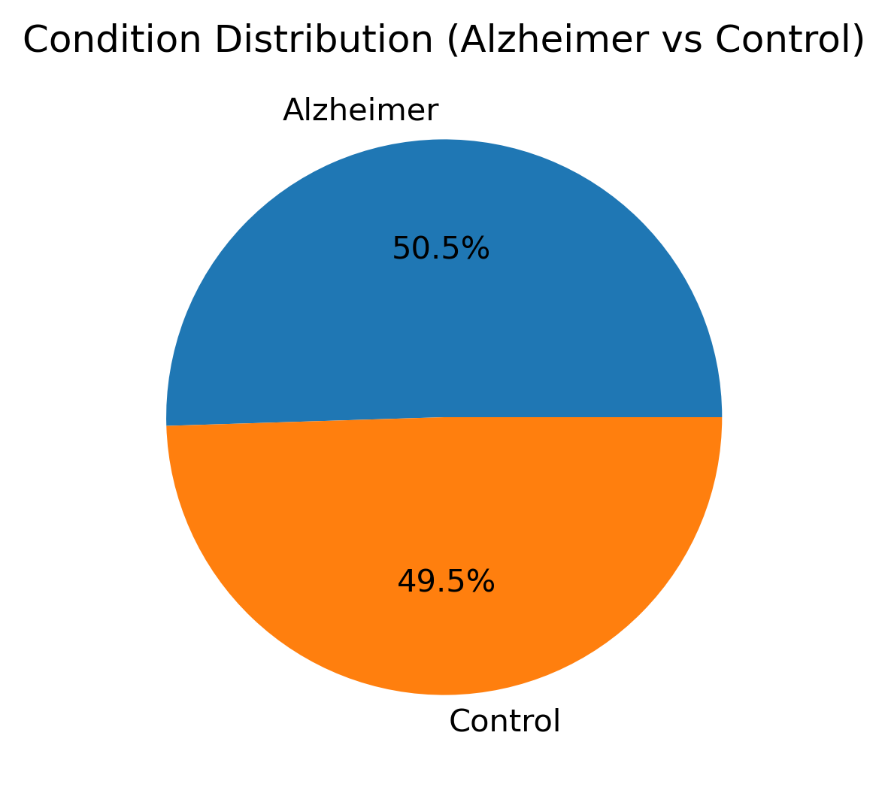
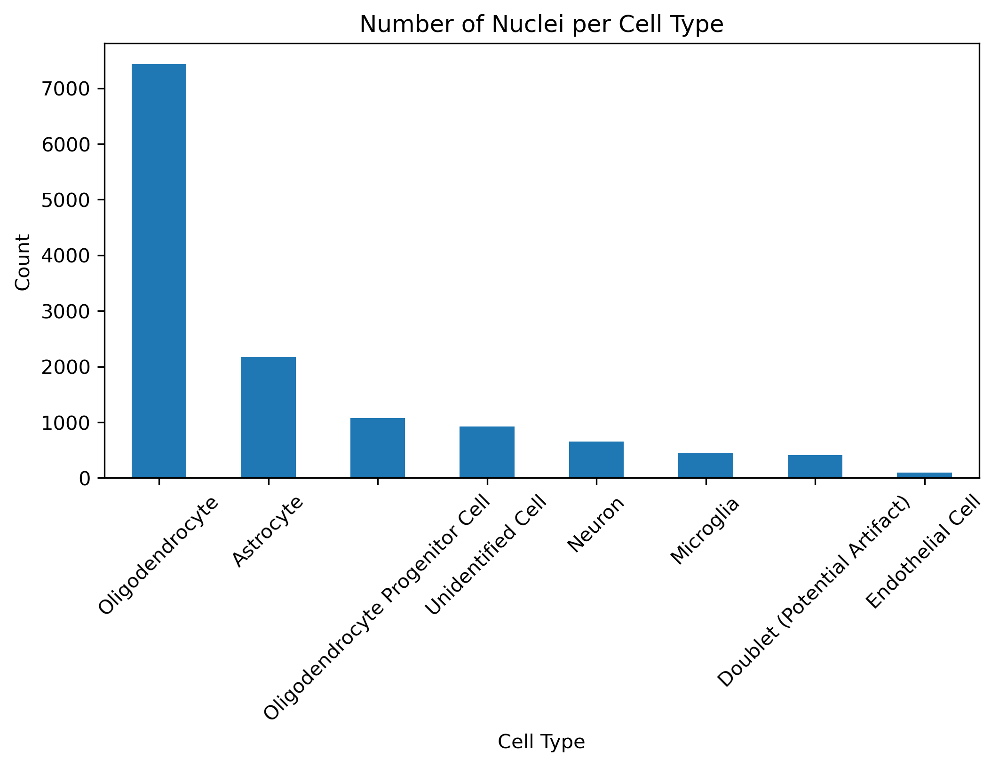
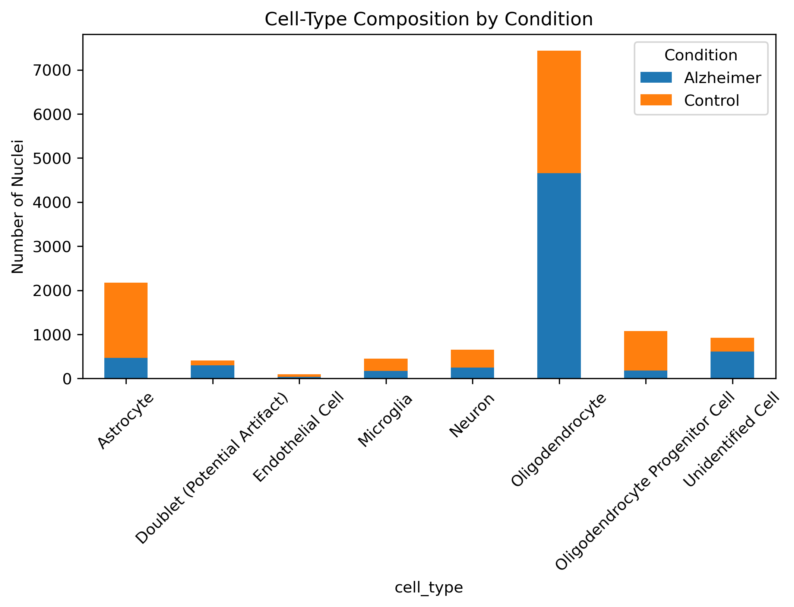
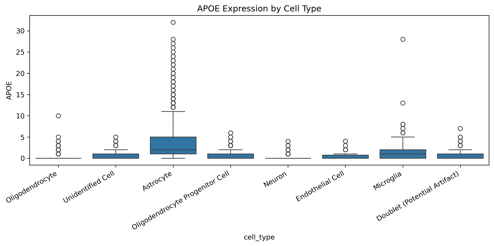
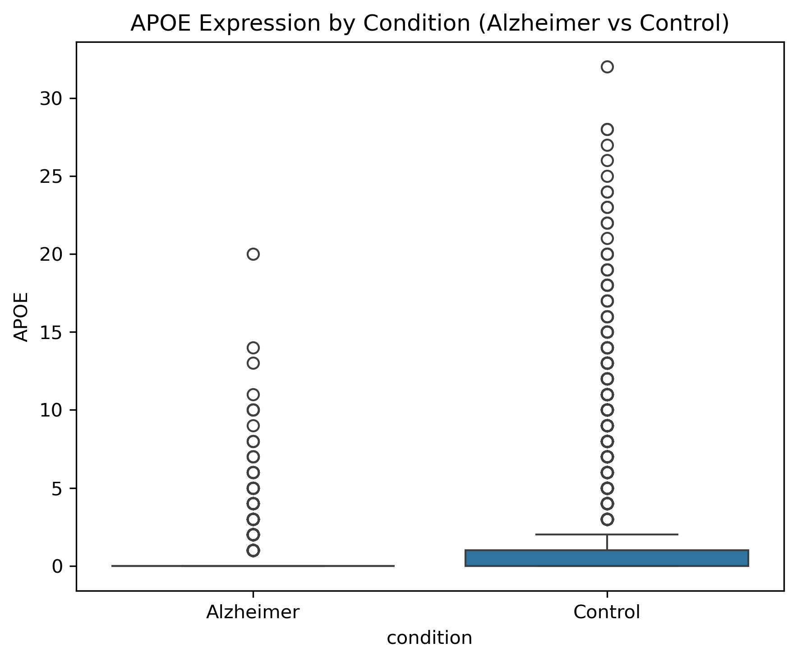
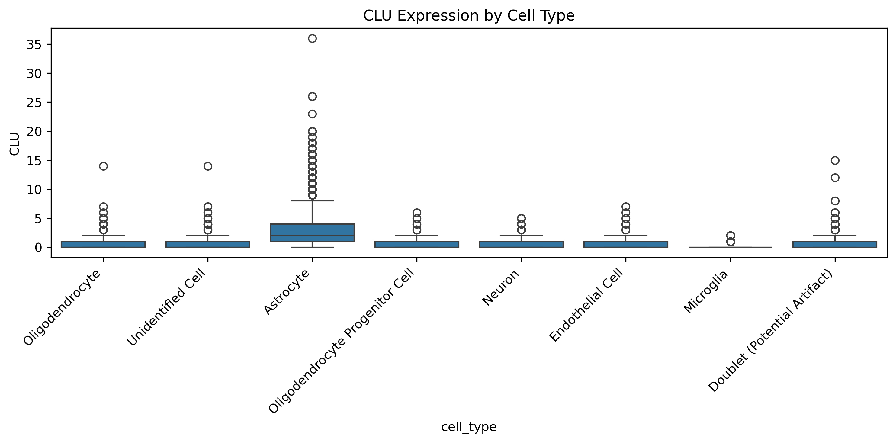
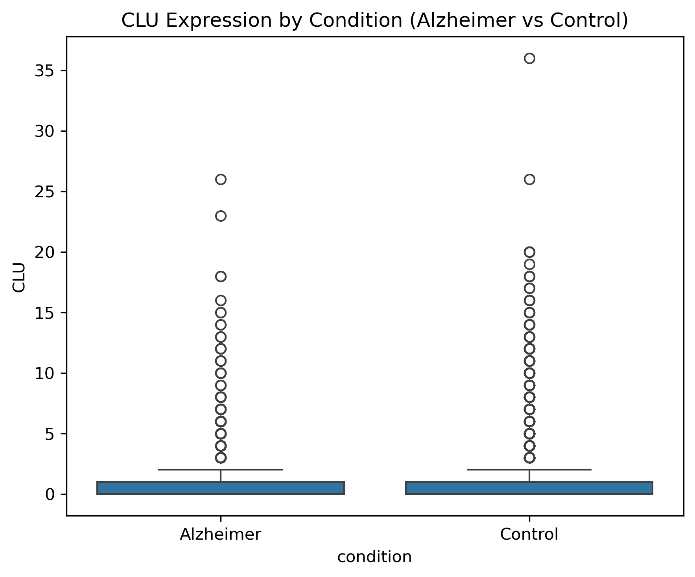
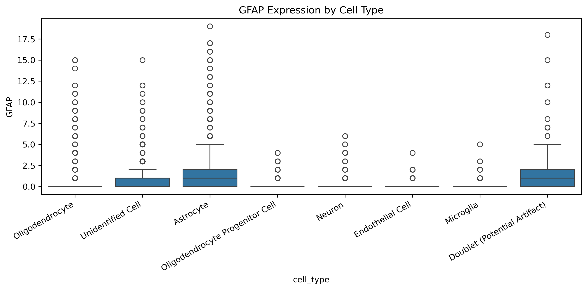
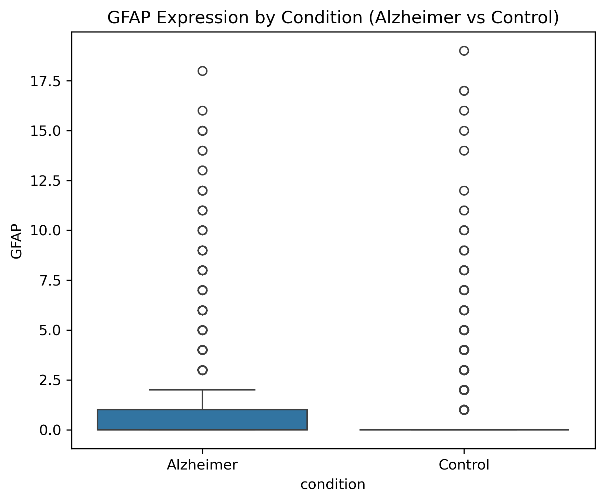
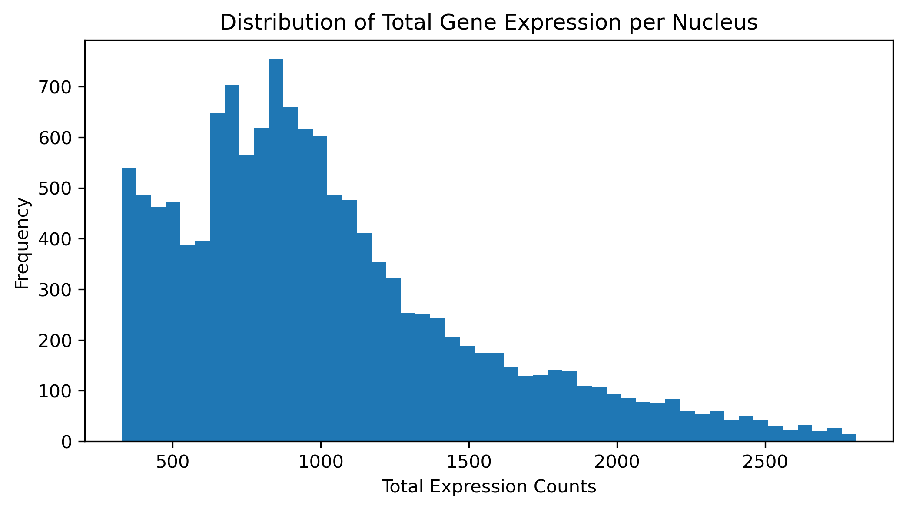

# Alzheimer’s Disease snRNA-seq Analysis (Entorhinal Cortex)

**Author:** Olivia Mohning  
**Dataset:** GSE138852 — Single-nucleus RNA sequencing (snRNA-seq) from the entorhinal cortex of aged individuals with and without Alzheimer’s disease (12 donors, 13,214 nuclei).  
**Goal:** Explore cell-type composition and key gene expression patterns associated with neurodegeneration.

---

## 1. Dataset Overview

This dataset contains processed count matrices and metadata for nuclei isolated from Alzheimer’s disease (AD) and control (Ct) brain samples. After merging the counts and covariates, the final data frame included **13,214 nuclei** and **10,850 genes**, with metadata fields describing cell type, condition (AD vs. Ct), and subcluster identity.

The condition distribution shows a balanced representation of both groups:

---

## 2. Cell-Type Composition

Nuclei were annotated into eight major cell types: oligodendrocytes, astrocytes, oligodendrocyte progenitor cells (OPCs), neurons, microglia, endothelial cells, doublets, and unclassified cells.  
Oligodendrocytes were the most abundant, followed by astrocytes and OPCs.

When stratified by condition, the stacked bar chart below shows differences in cell-type proportions between AD and control samples.

---

## 3. Expression Patterns

Three Alzheimer’s-relevant genes were examined:

- **APOE** — a key genetic risk factor for late-onset Alzheimer’s  
- **CLU** — involved in lipid metabolism and amyloid clearance  
- **GFAP** — a canonical astrocyte activation marker

Expression varied strongly by cell type and condition, with astrocytes and microglia showing the highest APOE and GFAP expression levels. These observations align with known patterns of glial activation in Alzheimer’s pathology.

| Expression by Cell Type | Expression by Condition |
|:------------------------:|:------------------------:|
|  |  |
|  |  |
|  |  |

---

## 4. Distribution and Quality Check

The histogram below shows the distribution of total expression counts per nucleus. The continuous, right-skewed distribution suggests a realistic spread of sequencing depth across cells, with no major technical artifacts.

---

## 5. Summary

This exploratory analysis demonstrates how single-nucleus RNA sequencing data can reveal **cell-type–specific transcriptional changes** in Alzheimer’s disease. Using Python (pandas, numpy, seaborn, matplotlib), the workflow integrates data ingestion, cleaning, and visualization to uncover biologically meaningful trends—such as elevated APOE and GFAP expression in glial populations.

The resulting notebook provides a reproducible framework for future expansion, such as differential expression testing or visualization of additional neurodegeneration-related pathways.
